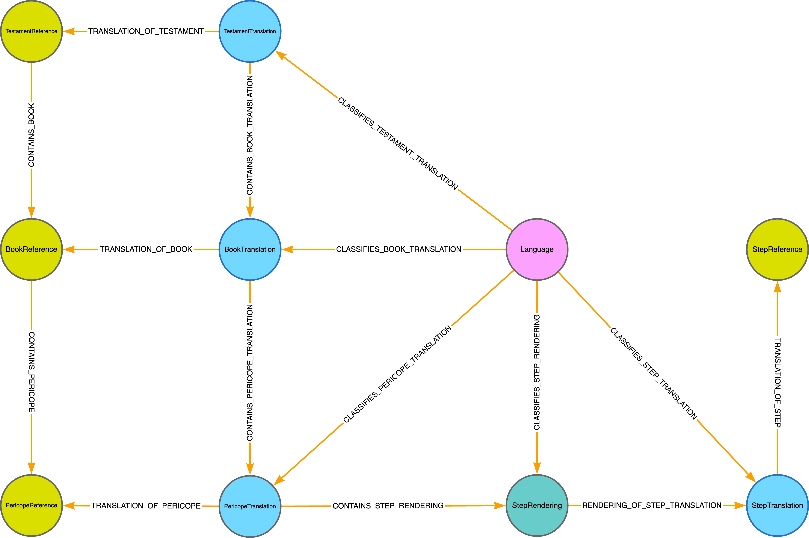

<!-- omit in toc -->
# Church Based Bible Translation - Exegetical Resources (CBBT-ER)

<!-- omit in toc -->
## Table of Contents

- [About the Project](#about-the-project)
- [About this Repository](#about-this-repository)
- [Key Terms](#key-terms)
- [GraphQL Schema](#graphql-schema)
	- [References](#references)
		- [BookReference](#bookreference)
		- [PericopeReference](#pericopereference)
			- [An Explanation of Pericope IDs](#an-explanation-of-pericope-ids)
		- [StepReference](#stepreference)
	- [Translations](#translations)
		- [Language](#language)
		- [BookTranslation](#booktranslation)
		- [PericopeTranslation](#pericopetranslation)
		- [StepTranslation](#steptranslation)
	- [Renderings](#renderings)
		- [StepRendering](#steprendering)
			- [Markdown, HTML and Plain Text](#markdown-html-and-plain-text)
			- [Audio File Names](#audio-file-names)
- [Next Steps:](#next-steps)
- [Disclaimer](#disclaimer)

## About the Project

Proper internalization of Scripture is the key to effective Bible translation. CBBT-ER is built with proper orality strategies for primary oral learners. It provides a 6-step internalization process for every pericope in the Bible in audio format. Pericopes will also contain attached <b>asset types</b> (i.e. photos, videos, illustrations, diagrams, and maps) of different <b>media items</b> (i.e. people, places and things) contained throughout scripture to further help aid in the internalization process. The project started in 2022 and is still in development. Because material is still being created and revised, please treat all materials as a draft (see [disclaimer](#disclaimer)).

The project has completed Genesis, Matthew, Mark and Luke, with Job, John and Acts in development. Pericope step development starts with English and is then translated into 14 other languages, including American Sign Language (ASL).

We estimate there to be 2893 pericopes in the Bible, and will have 4 audio (video for Deaf) file compressions per step. If you're doing the math, that's a total of 1,041,480 audio/video files for the 6 steps, and that number doesn't include the attached <b>media items</b>. There are currently 352 <b>media items</b> in production at the moment, 279 of those are photos and videos.

## About this Repository

This repo is meant to be a temporary/alternate location to the GraphQL API in development. Therefore, it's encouraged to <em>not</em> rely on direct links to the JSON files contained in this repo for production code, as they are subject to change and deprecation in the future. However, this repo will use proper versioning tags (e.g. [semver.org](https://semver.org)), as to alert the user when there are version-breaking changes.

## Key Terms

<dl>
<dt>Pericope</dt>
<dd>A pericope is a "set of verses that forms one coherent unit or thought." - <a target="_blank" href="https://en.wikipedia.org/wiki/Pericope">Wikipedia</a></dd>
<dt>Media Item</dt>
<dd>A <b>media item</b> is a person, place or thing as it existed in history. Examples include "Camel," "Roman Sword," "Sea of Galilee," "Herod's Temple" and "Sheep." Since Jerusalem looked different during the time of Jesus than it did during the time of David, those 2 instances of Jerusalem would count as 2 separate <b>media items</b>. <b>Media items</b> can have one or more <b>asset types</b> (i.e. photos, videos, illustrations, and diagrams) associated with each <b>media item</b>. Videos will also have verbal recordings in 15 languages describing the items.</dd>
<dt>Asset Type</dt>
<dd>If a <b>media item</b> is a person, place or thing, an <b>asset type</b> is the photo, video, illustration, and/or diagram attached to the <b>media item</b>. When we refer to an <b>asset type</b> as a photo, we <em>aren't</em> talking about a file format (e.g. PNG, JPEG, etc.). We are referring to something captured on a camera. Some things, like "Camel," can be photographed today. Other things like "Herod's Temple" no longer exist. Therefore, they have to be illustrated and/or diagramed.</dd>
</dl>

## GraphQL Schema

When working with the JSON files, and future GraphQL API, there are a few schema types that might not appear intuitive upon first glance. However, the basic structure is straight forward. Testaments (i.e. Old and New Testaments) contain books (e.g. Mark, Acts, etc.), books contain pericopes, and each pericope contains 6 steps. The important part is understanding the difference between "References," "Translations" and "Renderings."

<b>References</b> are the primary nodes and are language agnostic. For example, the book of Mark has only one <b>BookReference</b> node. With 66 books in the Bible, there are 66 <b>BookReference</b> nodes in total. Since the project is targeting 15 translations, there will be 15 <b>BookTranslation</b> nodes for each <b>BookReference</b>. This is a one-to-many relationship, and that pattern of References to Translations continues throughout the project (e.g. There are 6 <b>StepReference</b> nodes and 15 <b>StepTranslation</b> nodes per <b>StepReference</b>). References always contain the language-agnostic information. For example the starting and ending chapters and verses for a pericope will only be contained in the <b>PericopeReference</b> node. Information pertaining to the translation will only be contained in the <b>PericopeTranslation</b> node.

So what about "renderings" mentioned earlier? A <b>StepRendering</b> exists at the intersection of <b>PericopeTranslation</b> and <b>StepTranslation</b>. If <b>PericopeTranslation</b> was one river, and <b>StepTranslation</b> was a second, <b>StepRendering</b> would be the [confluence](https://en.wikipedia.org/wiki/Confluence). It's the main source of information containing the transcripts and audio files for each step in each pericope of a given language translation.

To further help understand this pattern, please see the graph diagram below. In the near future, we'll add the <b>MediaItem</b> and associated types attached to the <b>PericopeReference</b> nodes.



### References

#### BookReference

```graphql
type BookReference {
  # Fields:
  id: ID! # "mrk"
  title: String! # "Mark"
  lineup: Int! # 41
  # Relationships:
  bookTranslations: [BookTranslation!]!
  pericopeReferences: [PericopeReference!]!
}
```

#### PericopeReference

```graphql
type PericopeReference {
  # Fields:
  id: ID! # "mrk-p19a"
  pId: ID! # "p19a"
  sequence: Int! # 19
  split: String # "a"
  startChapter: Int! # 5
  startVerse: Int! # 21
  startPortion: String # "b"
  endChapter: Int! # 5
  endVerse: Int! # 34
  endPortion: String # "a"
  verseRange: String! # "5:35b-43a"
  # Relationships:
  bookReference: BookReference!
  pericopeTranslations: [PericopeTranslation!]!
}
```

##### An Explanation of Pericope IDs

Pericope IDs first start from lists developed by [Faith Comes by Hearing (FCBH)](https://www.faithcomesbyhearing.com), and are roughly 10.5 verses on average. Before work on a new book begins, it is determined whether or not one or more pericopes need to be split. This is done to ensure that pericopes aren't too long for oral audiences. Once the list is set, pericope IDs get assigned in sequential order. For example, verses 1:1-13, 1:14-20 and 1:21-28 will get pericope IDs of p1, p2, and p3. Using pericope IDs, instead of verses, have been helpful and resulted in less human-prone mistakes.

As work begins, it is often the case that a few pericopes need to be split further. Again, this is usually due to the amount of exegetical material that needs to be communicated to an oral audience. When this happens, pericope IDs are given an additional letter to signal the split. For example, "p1" might become "p1a" and "p1b". It's done this way to ensure that the remaining pericope IDs don't change, as they might already be assigned to other individuals.

You should notice that files names will contain the letter "p" in "p1" to distinguish it from other IDs contained in the file name. This is referred to as the "pId" in the schema. However, it's separate components can be gathered via the "sequence" (e.g. "19" in "p19a") and "split" (e.g. "a" in "p19a") fields.

#### StepReference

```graphql
type StepReference {
  # Fields:
  id: ID! # 1
  sId: ID! # "s1"
  title: String! # "Hear and Heart"
  # Relationships:
  stepTranslations: [StepTranslation!]!
}
```

### Translations

#### Language

```graphql
type Language {
  # Fields:
  id: String! # "eng"
  namePrefix: String # "Mandarin"
  name: String! # "Chinese"
  languageOfPrefix: String # "United Republic of"
  languageOf: String! # "Tanzania"
  # Relationships:
  bookTranslations: [BookTranslation!]!
  pericopeTranslations: [PericopeTranslation!]!
  stepRenderings: [StepRendering!]!
  stepTranslations: [StepTranslation!]!
}
```

#### BookTranslation

```graphql
type BookTranslation {
  # Fields:
  id: ID! # eng-mrk
  title: String # Mark
  # Relationships:
  bookReference: BookReference!
  language: Language!
  pericopeTranslations: [PericopeTranslation!]!
}
```

#### PericopeTranslation

```graphql
type PericopeTranslation {
  # Fields:
  id: ID! # eng-mrk-p1
  # Relationships:
  language: Language!
  bookTranslation: BookTranslation!
  pericopeReference: PericopeReference!
  statuses: [Status!]!
  stepRenderings: [StepRendering!]!
}
```

#### StepTranslation

```graphql
type StepTranslation {
  id: ID! # eng-s1
  title: String # Hear and Heart
  # Relationships:
  language: Language!
  stepReference: StepReference!
  stepRenderings: [StepRendering!]!
}
```

### Renderings

#### StepRendering

```graphql
type StepRendering {
  # Fields:
  id: ID! # eng-mrk-p1-s1
  scriptWordCount: Int # 89
  scriptMarkdown: String
  scriptHTML: String
  scriptPlainText: String
  audioVBR4Url: String # eng-gen-p58-s4_vbr-4.mp3
  audioVBR6Url: String # eng-gen-p58-s4_vbr-6.mp3
  audioCBR32Url: String # eng-gen-p58-s4_cbr-32.mp3
  audioVBR4Size: Int # 3559340
  audioVBR6Size: Int # 2791052
  audioCBR32Size: Int # 2042924
  # Relationships:
  language: Language!
  pericopeTranslation: PericopeTranslation!
  stepTranslation: StepTranslation!
}
```

##### Markdown, HTML and Plain Text

All 6 written pericope steps will be contained in Markdown, HTML, and plain text. Those are currently being converted through both automated and manual processes with an editor who ensures proper semantic meaning, grammar, etc. These files are still being converted and checked. Therefore, please be patient as we complete that process.

##### Audio File Names

Audio files contain the following information at the end of the file name: "vbr-4", "vbr-6", and "cbr-32". This refers to "Variable Bitrate" and "Constant Bitrate". The number at the end of "vbr" refers to the quality level—the higher the number, the more compressed it is. The number at the end of "cbr" means that the audio contains a <em>consistent bitrate</em> of "32" throughout the audio file. The files go from larger to smaller in this order: (1) vbr-4, (2) vbr-6, (3) cbr-32. Although simpler terminology, like small, medium and large, could have been used, we felt it was important for developers to understand the type of compression they were getting.

For more information on compression levels, please visit the [FFmpeg MP3 Encoding Guide](https://trac.ffmpeg.org/wiki/Encode/MP3).

## Next Steps

- adding <b>media items</b> (i.e. photos and videos) into our conversion/compression processes.
- rebranding CBBT-ER (I promise we'll give it a better/easier name with no more than two words)
- front-facing web application geared toward oral audiences
- Since latency is a big issue around world, we'll be working on a better long-term solution for edge-located databases/APIs.

## Disclaimer

All of CBBT-ER’s available English materials have been consultant checked by Bible translation consultants. However, we are continually in the process of revising our materials. Translations of the materials are translated from the English consultant checked materials, but not all of the translations themselves have been consultant checked by someone who speaks the language.

**Please treat all English and non-English materials as a draft**, and contact us with any questions or concerns at cbbt-er@srvpartners.org.
